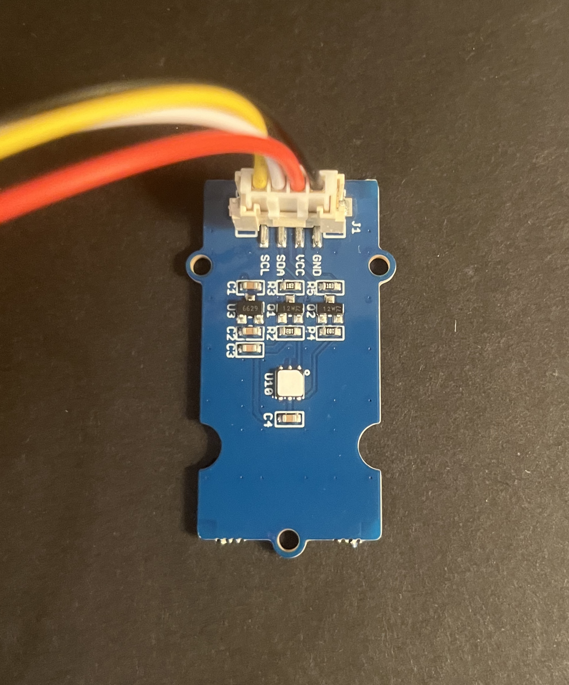
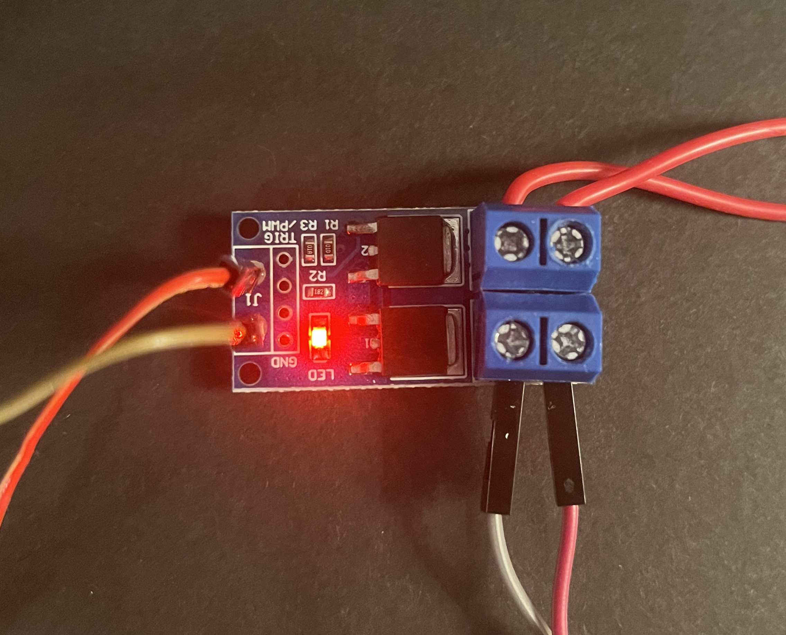

# Wiki mushrooms controller

## Description du projet et des membres

Le projet consiste à réaliser un système de contrôle d'environnement pour aider au développement in vitro de champignons.

Le projet comporte 4 membres :
- Léo Marché
- Gwennan Eliezer
- Jean Le Menn
- Ariane Dauvergne

Nous avons tous participés à la rédaction de la spécification, à la recherche de solutions techniques et à l'élaboration des modèles. Même si le code a été écrit sur l'ordinateur de Léo Marché, nous avons tous participés à sa conception.

## Problématique liée au projet

La myciculture in vitro est une pratique qui consiste à faire grandir du mycélium, la partie principale d'un champignon, dans un environnement artificiel. Le développement est divisé en trois phases qui ont des besoins différents pour une croissance optimale :

1. L'incubation sur boîte de Petri
2. L'inoculation et la colonisation
3. La fructification

Ces phases ont toutes des besoins en température et en humidité différents, qui varient en fonction des espèce en croissance. Par exemple, pour faire pousser du pleurote (_pleurotus ostreatus_), les conditions sont les suivantes :

1. Température de croissance (entre 20°C et 25°C) ; Humidité non contrôlée (entre 40% et 60% en France)
2. Température de croissance (entre 20°C et 25°C) ; Forte humidité (plus de 95%)
3. Basse température (entre 15°C et 20°C) ; Forte humidité (plus de 95%)

### Cahier des charges

Pour répondre à la problématique, nous nous sommes posés un cahier des charges, sous forme d'une liste

- Stabilité des variables suivantes (et tolérances respectives) 
    - humidité de l’air (± 5%)
    - température de l’air (± 1°C)
- Résilience aux pannes réseau
- Adaptabilité à différentes tailles de chambres isolées
- Paramétrage pour la croissance d’espèce en particulier
- Différents modes de fonctionnement
    - "Croissance sèche" : 24°C ; XX%
    - "Colonisation du grain" : 24°C ; 95%
    - "Fructification" : XX°C ; 95%
- Possibilité de fonctionner sans le Raspberry Pi (avec un contrôle manuel)
- Pouvoir paramétrer et surveiller à distance le système

## Matériel utilisé

Notre problématique principale étant le contrôle de la température et de l'humidité dans l'environnement, nous avons besoin, pour chacune de ces deux métriques, d'un ou plusieurs capteur(s) et actionneur(s).


### Electronique

Pour gérer la logique d'asservissement, nous avons besoin d'une boucle de contrôle (numérique ou analogique). Nous avons décidés de la programmer sur un microcontroleur Arduino.

En terme d'alimentation, nous utilisons deux tensions différentes :
- 5V pour la logique de contrôle et l'alimentation des cartes et capteurs
- 12V pour l'alimentation

### Contrôle des paramètres physiques

Pour augmenter la température dans l'incubateur, nous avons opté pour une résistance chauffante, placée sur un radiateur.

Pour augmenter  l'humidité, nous avons choisi un système actif, un petit atomiseur ultrasonique, responsable de projeter des millions de gouttelettes d'eau, dont une grande partie viendra saturer l'air dans le volume. Ce système a l'avantage d'humidifier l'air extrêmement vite, avec le défaut que le contrôle précis de l'humidité est impossible. On peut donc considérer que l'humidité varie en tout ou rien, de 40% à 100%. Nous avons fait ce choix en conscience, puisque que pour toutes les espèces, l'humidité optimale est la saturation de l'air, à 100% d'humidité.

### Contrôle à distance

Afin de pouvoir contrôler le système, nous avons une raspberry PI connectée à l'arduino par un port usb série. À travers ce port, nous avons la possibilité de lire les températures et humidités attendues et effectives, ainsi que d'écrire de nouvelles températures et humidités attendues. Nous avons donc écrit un serveur sur le raspberry PI, qui va ainsi se connecter au système et enregistrer les données reçues par le système. Ce serveur sert également un site web sur lequel nous pouvons visualiser les données enregistrées sur un graphique et changer la température et l'humidité.

Le serveur donne également un endpoit pour spécifier un "programme", c'est-à-dire un ensemble de dates avec une température et une humidité à chacune d'entre elles, que le serveur suivra.

Exemple de requète qui modifie la température et l'humidité le 12 et 15 janvier 2023:

```json
[
    {"date": "2023-01-12T12:00:00", "hygro": 40.0, "temp": 50.0},
    {"date": "2023-01-15T12:00:20", "hygro": 50.0, "temp": 25.0}
]
```

### Liste exhaustive

Pour réunir au même endroit tout le matériel, et préciser ceux qui ne seront pas mentionnés dans cette page wiki car triviaux, la liste des composants :

- Glacière isotherme
- RaspBerry Pi
- Arduino Nano


- câble connexion (mini USB B - USB)
- 2x - Sondes thermo-hygrométrique



- Afficheur LCD


- Alimentation 12v
- Convertisseur buck 12V vers 5V


- Pilote de tension MOSFET



- Résistance chauffante
- Radiateur thermique
    


- Atomiseur d’eau + système de contrôle
<!-- - Système de commande local
    - Potentiomètre ? (analogique / numérique) (fourni)
    - Boutons push ? (fourni) -->

## Scénario d’utilisation

L'incubateur viendra remplacer la première version de Jean, qui profitera de nos améliorations. La croissance en phase 2 et 3 étant relativement lente, l'autonomie du nouveau système sera bienvenue pour garantir un meilleur rendement de récolte de champignons.


### Vidéo démonstration
[Vidéo](https://drive.google.com/file/d/1ylCFXbtSbC1U3Ff9kjLJv8QUzL52shs3/view)
<!-- [Vidéo démo](/photos/video.mp4 "Vidéo démonstration du projet en fonctionnement") -->

### Pour une récolte type

1. Le phénotype (individu) est cloné d'une boîte de Petri à une autre pour garantir sa fraicheur pour la croissance. L'intervention est faite dans un milieu stérile.
2. La boîte est placée dans l'incubateur avec le réglage __"Croissance sèche"__, et la température s'adapte automatiquement pour 24°C (sans changement pour l'humidité).
3. Environ 3 jours s'écoulent.
4. Quand le mycélium a colonisé toute la surface de la boîte, un morceau de gélose est placé dans du grain stérilisé (du riz pour le pleurote), dans un pot en verre avec un couvercle filtrant.
5. Les pots sont à leur tout placés dans l'incubateur avec le réglage __"Colonisation du grain"__ de nouveau, la température se règle à 24°C et l'humidité à 95%.
6. Environ 7 jours s'écoulent.
7. Le grain est utilisé pour répendu le substrat stérilisé (de la paille céréalière pour le pleurote), le tout est placé dans un sac scellé, un sac de congélation dans notre cas. La masse de substrat choisie déterminera la masse de champignon récoltée.
8. Les sacs sont placés dans l'incubateur avec le réglage __"Croissance sèche"__.
9. 7 à 14 jours s'écoulent en fonction du volume du sac.
10. Les sacs sont fendus en forme de croix pour créer un contact entre le mycélium et l'air humide. Le champignon a assez d'énergie pour pousser à ce stade.
11. Les sacs ouverts sont placés dans l'incubateur avec le réglage __"Fructification"__, l'humidité est conservée à 95%, tandis que la température baisse jusqu'à l'ambiante.
12. Phase finale, les champignons poussent en quelques jours et sont prêts à être récoltés.
13. (Optionnellement, les sacs peuvent donner une deuxième voire une troisième récolte si on leur laisse le temps.)

## Budget

| Composants  | Prix |
| --- | --- |
| Commande | 70€ |
| Puissance | 44€ |
| Actionneurs | 25€ |
| Capteurs | 25€ |
| IHM (écran LCD) | 7€ |
| __Total__ | __171€__ |


## Bilan
_vous avez répondu à la problématique, même en partie_

Nous arrivons bien à contrôler les paramètres choisis dans l'enceinte de l'incubateur, ce qui répond au moins à l'essentiel de notre problématique.

_Cahier des charges point par point_

## Futur du projet

Manque du paramètre lumière.